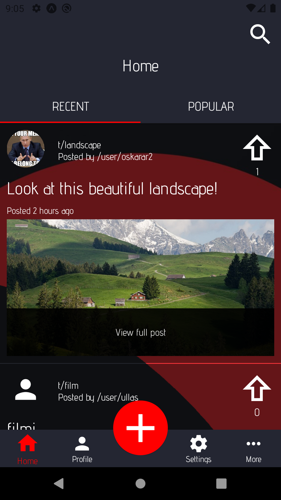
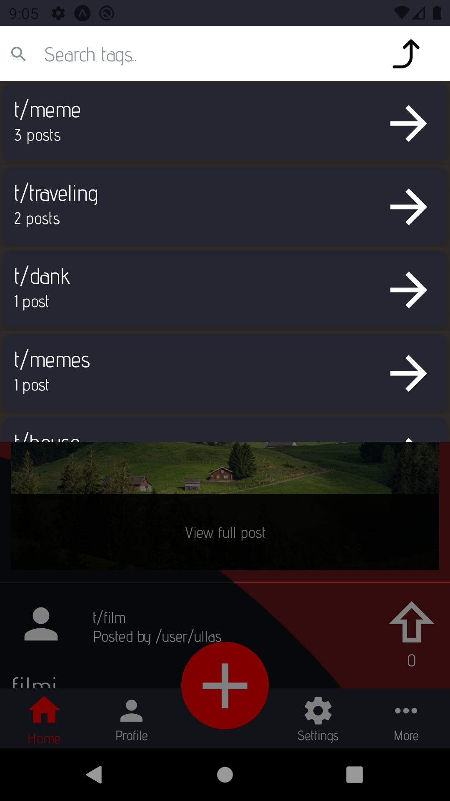
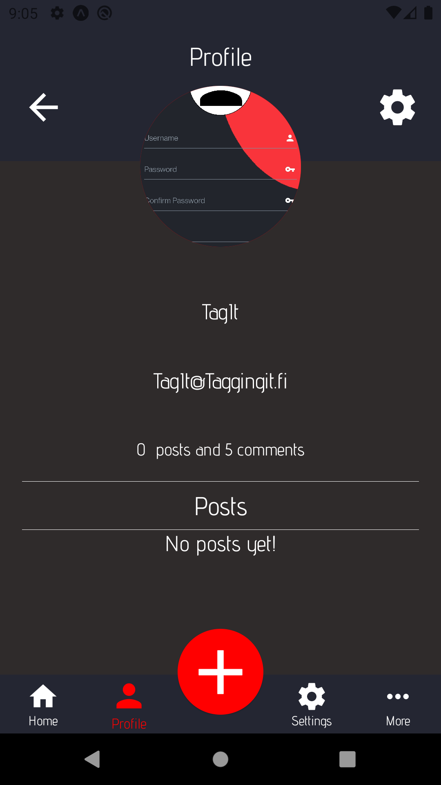
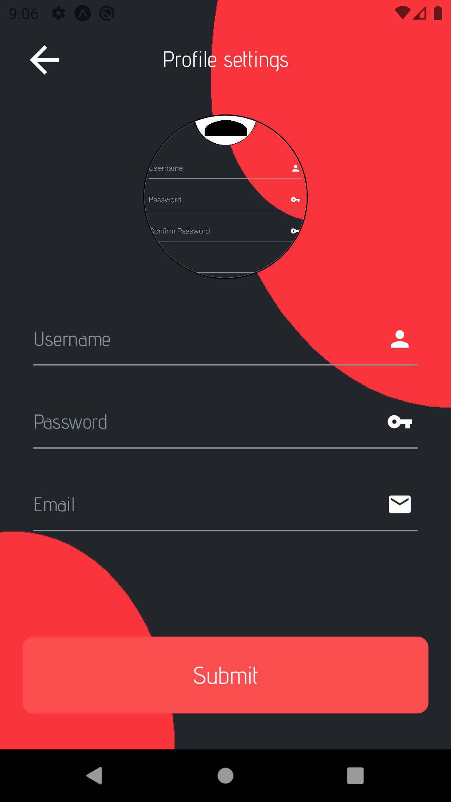
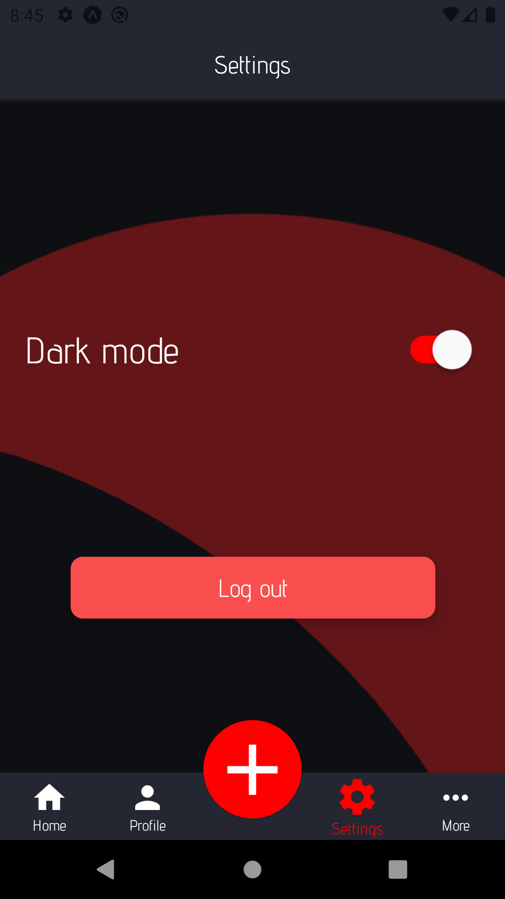
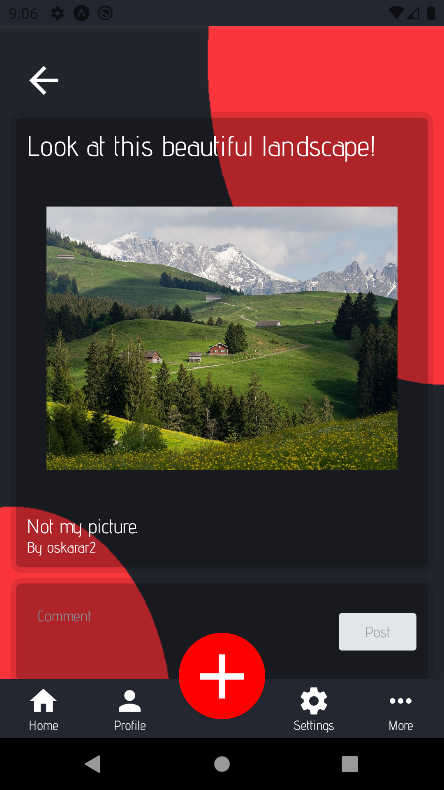

# Tag-It

This project is written in JavaScript using React Native as well utilizing its libraries, such as react-native-elements, react-native-modal, react-navigation and more.
The project itself is a web-based mobile application, which lets the end user browse topics of his/her liking, as well  post thoughts, opinions, ideas, memes and whatever else they feel like. The purpose is to connect people, and help finding like minded people in tags that interest you.
The main target audience varies, as it depends on which tag is being used. For example, the age range can vary from 15-years old gamers to 70-years old grandmothers.

The project utilizes a simple media sharing service backend by [Metropolia UAS](https://www.metropolia.fi/en). Documentation for the API can be found [here](https://media.mw.metropolia.fi/wbma/docs/).

[Demonstration video](https://drive.google.com/file/d/1s4qOdOxkE8dbngSWTd8u481UntUv8QEw/view) showing the app being used.
# Features

The accessable features depend whether the user is unregistered or registered. 

Features unregistered users are able to access:
-	View other posts
-	Read comments
-	View other users profiles
-	Search for tags
-	Use settings
-	Login

Features registerd users can access (in addition of unregistered user features):
-	Upload and delete own posts
-	Upvote posts and comments
-	Create comments
-	Modify own profile information

# Views

The application consists of several views, with each having their own purpose. The registered status of the user defines the accessibility of each view.

## Home

The main view of the application, which contains one of the main functionalities. Here, the user can browse posts created by other users. It has two sub views, which display the most recent and popular posts. These lists change according to the tag the user has chosen. Tags can be searched by clicking the top right corner’s search icon and using the search view. 

  
  

## Profile, Settings and More

The Profile view contains all the data of an user. Here, you can find the contact information, posts created by the user as well the user’s avatar. The users can also modify their profile information using the top right cog button. 

The Settings view has a toggle for dark mode, as well as a login or logout button depending on the logged in status of the user.

The More view displays several mockup buttons, which don’t have any functionality in addition of adding design.

  
  
  
  

## Creation of posts
Using the round red button on the middle of the navigation bar, the user can access the Create view, where the creation of posts happens. All the input fields are required: an image/video, a tag, title and a description for the post.

Posts can be viewed in the Post view, which can be opened up by clicking any post the user chooses. In addition of the information displayed in the Post view, the user can see comments made by other users.

  
  

# How to use
Clone this project via ``git pull https://gitlab.metropolia.fi/tag-it/mobile-app.git``

Run ``npm install`` to get all dependencies installed

Run either ``expo start`` or ``expo start --no-dev --minify`` depending on whether you want dev mode or not

# Misc

This was a group project for a web based mobile application course @ [Metropolia UAS](https://www.metropolia.fi/en). 

# Authors

_Markus Nivasalo_
- Email: _markus.nivasalo (at) metropolia.fi_
- Git: https://github.com/markusniv

_Jani Salo_
- Email: _jani.salo2 (at) metropolia.fi_
- Git: https://github.com/janiksa

_Oskari Arponen_
- Email: _oskari.arponen (at) metropolia.fi_
- Git: https://github.com/AOskari
